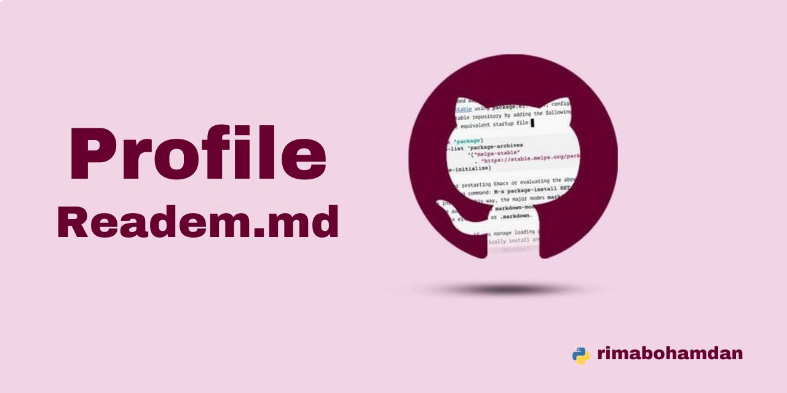

# **👋🏻 Hi, I'm Rima !**

##
 🌱 I’m passionate about programming and I currently learning the Python programming language and working on enhancing my skills in it. 
 
 👯 I'm looking to collaborate on open- source projects and interesting coding challenges.

 📫 How to reach me: Feel free to connect with me on [LinkedIn](https://www.linkedin.com/in/rima-bohamdan-1a9998251)
 
 😄 Pronouns: She / Her
 
 ⚡ Fun fact: Coding is my passion, and I believe in the power of well-written code to make a positive impact.

### Certificates
**1.Python Intermediate**

**2.Introduction to Python**
 
